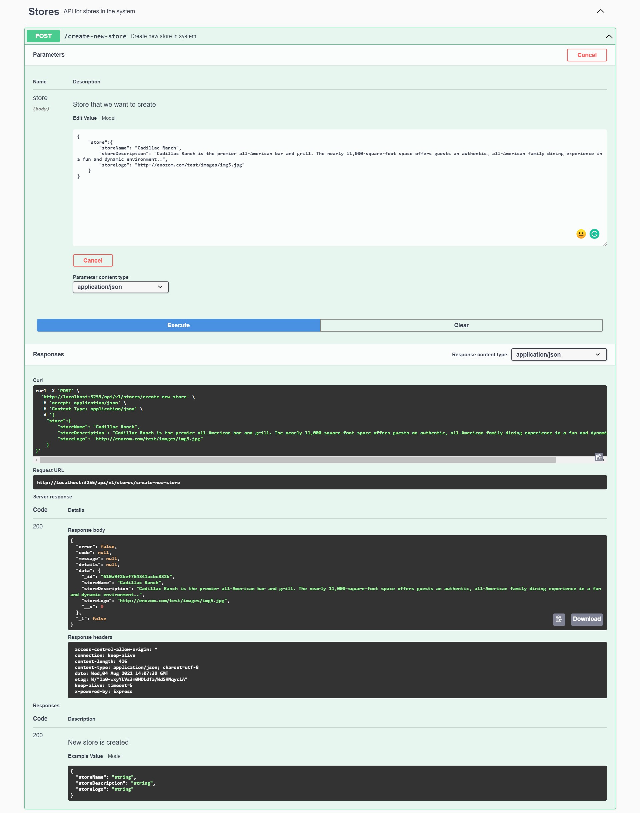

# Food court management app backend

This is a Back-end for a Food Court Management App.

This project is written using NodeJS & ExpressJS for the Back-end & MongoDB for Database.

## How to install
1. First you need to download NodeJS Installer from [here](https://nodejs.org/en/) & install it
2. Then, you need to download MongoDB Installer from [here](https://www.mongodb.com/try/download/community) & install it
3. Now you're ready to clone the project, just run  `git clone https://github.com/HossamMamd0uh/food-court-management-app-backend.git`

## How to run
1. Navigate to project directory and run `npm install`
2. To start the server run `npm start`
3. The server by default is listening on port **3255**
4. Now the server is running and if you installed MongoDB it should be connected automatically

## Full API documentation
**APIs documentation is implemented using SwaggerUI**
1. Start the server with `npm start`
2. In your browser, navigate to http://localhost:3255/api-docs/
3. You'll find a full list of application APIs and Mongo store model

Here's a sample of create store request:  

And here's a GIF of the same request:  

Data is sent as JSON inside body under an object called **store**, and here's a data sample you can start with:  
| storeName | storeDescription                                                                                                                                                                             | storeLogo                        |
| --------------- | -------------------------------------------------------------------------------------------------------------------------------------------------------------------------------------------------- | -------------------------------------- |
| Cadillac Ranch  | Cadillac Ranch is the premier all-American bar and grill. The nearly 11,000-square-foot space offers guests an authentic, all-American family dining experience in a fun and dynamic environment.. | http://enozom.com/test/images/img5.jpg |

## Project dependencies & libraries
- "@babel/core": "^7.7.4"
- "@babel/node": "^7.7.4"
- "@babel/preset-env": "^7.7.4"
- "nodemon": "^2.0.1"
- "body-parser": "^1.19.0"
- "cors": "^2.8.5"
- "dotenv": "^8.2.0"
- "express": "^4.17.1"
- "global-tunnel-ng": "^2.7.1"
- "method-override": "^3.0.0"
- "mongodb": "^3.3.4"
- "mongoose": "^5.7.13"
- "mongoose-autopopulate": "^0.10.0"
- "mongoose-unique-validator": "^2.0.3"
- "request": "^2.88.0"
- "swagger-jsdoc": "^6.1.0"
- "swagger-ui-express": "^4.1.6"
- "winston": "^3.2.1"